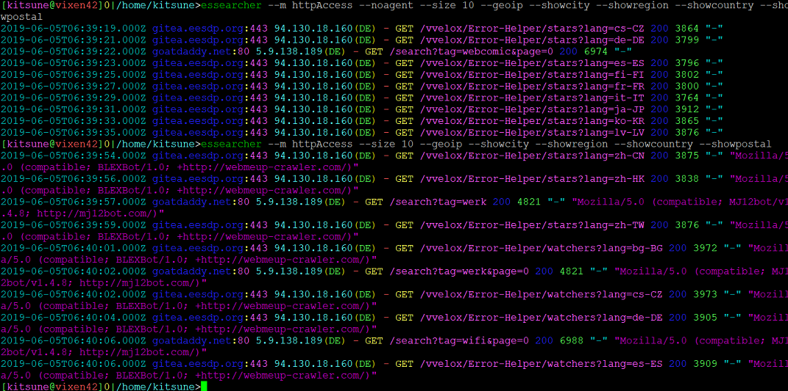

# About

It provides a dynamic system for searching logs stored in Elasticsearch. Currently it has out of the box support for the items below.

* [syslog](https://metacpan.org/pod/Search::ESsearcher::Templates::syslog)
* [postfix](https://metacpan.org/pod/Search::ESsearcher::Templates::postfix)
* [fail2ban via filebeat](https://metacpan.org/pod/Search::ESsearcher::Templates::bf2b)
* [HTTP access via filebeat](https://metacpan.org/pod/Search::ESsearcher::Templates::httpAccess)

It has 5 parts that are listed below.

* options : [Getopt::Long](https://perldoc.perl.org/Getopt/Long.html) options that are parsed after the initial basic options. These are stored and used with the search and output template.
* elastic : This is a JSON that contains the options that will be used to initialize [Search::Elasticsearch](https://metacpan.org/pod/Search::Elasticsearch).
* search : This is a [Template](https://metacpan.org/pod/Template) template that will be fed to [Search::Elasticsearch](https://metacpan.org/pod/Search::Elasticsearch)->search.
* output : This is a [Template](https://metacpan.org/pod/Template) template that will be be used on each found item.

It will search for those specified in the following order.

1. $ENV{'HOME'}.'/.config/essearcher/'.$part.'/'.$name
1. $base.'/etc/essearcher/'.help.'/'.$name
1. Search::ESsearcher::Templates::$name->$part (except for elastic)

# INSTALLING

# FreeBSD

    pkg install perl5 p5-JSON p5-Error-Helper p5-Template p5-Template-Plugin-JSON p5-Time-ParseDate p5-Term-ANSIColor p5-Data-Dumper
    cpanm Search::ESsearcher

## Linux

### CentOS

    yum install cpanm 
    cpanm Search::ESsearcher

### Debian

    apt install perl perl-base perl-modules make cpanminus
    cpanm Search::ESsearcher
 
